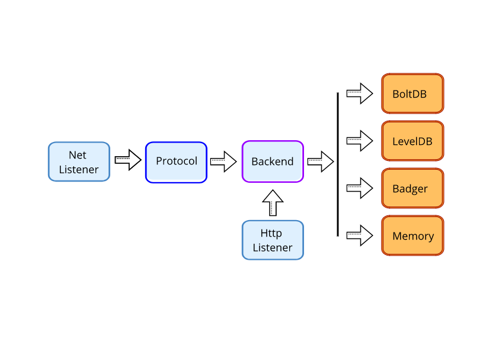

# Beano

## Beano is a key value database 

  - speaks memcached ascii protocol
  - persists to leveldb (native golang impl), boltdb, badger or memory
  - cache keys using bloomfilter (leveldb) or couting bloom filter (boltdb) to save I/O
  - can switch databases on the fly
  - can be set readonly
  - metrics ridden (expvar and go-metrics)
  - range queries by key prefix

## Build

  - Build locally with make
    - requires `dep`
    - check src/Makefile.defs for specific settings on lib and include paths. Type make. 

  - Use Vagrant + ansible (provided) to spin an Ubuntu server with mc-benchmark
    - vagrant up; vagrant ssh

  - Use ansible to build in your VPS 
    - ansible-playbook -i hosts.ini golang.yml
   
  - mc-benchmark used more as concurrency benchmark than speed. Currently it gets near ~~20~~40k writes/sec

## Running
	$ beano [-s ip] [-p port] [-f /path/to/db/file -q -b leveldb|boltdb|inmem]")
		- default ip: 127.0.0.1
		- default port: 11211
		- default backend: leveldb
		- default db path+file: ./memcached.db
		- (-q enables profiling to /tmp/*.prof")

## Memcached commands implemented
  - any regular memcached client will do
    - ascii quit                              [pass]
    - ascii version                           [pass]
    - ascii set                               [pass]
    - ascii set noreply                       [pass]
    - ascii get                               [pass]
    - ascii mget                              [pass]
    - ascii add                               [pass]
    - ascii replace                           [pass]
    - ascii delete                            [pass]

  - not in memcached specs: 
    - statdb - stats from leveldb
    - switchdb <dbname> - switch to new db file
    - range <prefix> [limit] - range query of keys that begin w/ prefix, limited by [limit]. no limit or -1 means bring it all.

- modified behaviour wrt memcached
    - gets - alias to range so all drivers can work.

## API
  - /api/v1/switchdb
    - changes database on the fly
    - example: curl -d "filename=/tmp/memcached2.db" http://127.0.0.1:8080/api/v1/switchdb

  - /debug/vars
    - expvar json

## Architecture

Network servers, command parsing and backend db implementations are split to make it easy to add new backends. That was inspired by memcached and made working on Beano easy.

The HTTP listener provides expvars and a basic api to switch datastores

Separated db modules means that I could implement caching in front of Boltdb that were natively present on LevelDB without leaking through the backend interface abstraction.

## TODO
   - It already pass the basics of memcapable -a for set/get/replace. Incr and Decr are wip. 
   - Better log configure (for now stats are dumped each 60 secs to log handler, not properly formatted)

## Why beano ?

Naming things is hard, so I've named this project after a blues breaker album that was named after a comic.

## Licensing: MIT

